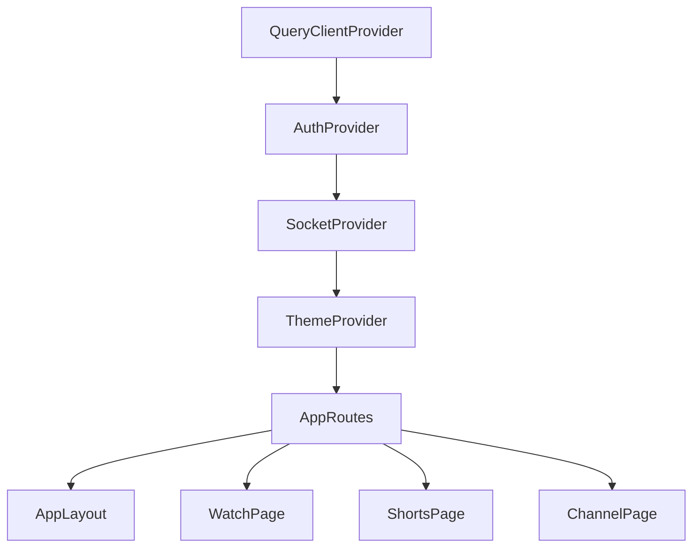

# Vixora Frontend — Master System Architecture & Component Manual

> **Purpose**: This document is a comprehensive architectural manual for the Vixora Frontend application. It provides complete specifications for state management, context providers, React Query caching policies, the video player engine, routing, component hierarchy, design tokens, and API integration layers for AI agents and developers.

---

## 1. System Overview & Technology Stack

| Layer | Technologies & Libraries |
| :--- | :--- |
| **Framework & Build** | React 18, Vite (v7.x ES Modules) |
| **Routing** | React Router DOM (v6.x) with Nested Route Layouts & Auth Guards |
| **Server State & Caching** | TanStack Query (React Query v5) with Infinite Queries & Optimistic Mutations |
| **Client State & Contexts** | React Context API (`AuthContext`, `SocketContext`, `ThemeContext`, `VideoPlayerContext`) |
| **Styling & Design System** | Tailwind CSS with Custom Dark Glassmorphism, HSL Tokens, Radix UI Primitives |
| **Video Playback Engine** | Custom HTML5 + HLS.js Player with Authoritative Duration Locking & Multi-bitrate Selector |
| **Real-time WebSockets** | Socket.io Client (v4.x) with Automatic Reconnect & Background Sync |
| **Icons & Micro-animations** | Lucide React, Framer Motion / Tailwind Animate, Canvas Confetti |
| **Form Handling & UI** | React Hook Form, Zod Validation, Radix Dialog / Dropdown / Slider / Tabs, Sonner Toasts |

---

## 2. Directory & Architectural Structure

```
frontend/
├── public/                    # Static Assets (Logos, Favicons, Fallback Images)
├── src/
│   ├── assets/                # Images, SVG Icons, Default Avatars
│   ├── components/            # Reusable UI & Domain Components
│   │   ├── ai/                # AI Components (AISummaryCard, AIChatPanel)
│   │   ├── channel/           # Channel Components (ChannelBanner, ChannelInfo, ChannelTabs)
│   │   ├── comment/           # Comment Components (CommentItem, CommentInput, CommentSection)
│   │   ├── common/            # Common Utilities (ParsedText, SEO, ShareDialog, ReportDialog)
│   │   ├── layout/            # Layout Components (Navbar, Sidebar, StudioSidebar, MobileNav)
│   │   ├── playlist/          # Playlist Components (PlaylistCard, PlaylistModal)
│   │   ├── subscriptions/     # Subscriptions Components (SubscribedChannelsBar)
│   │   ├── tweet/             # Community Post Components (TweetCard, TweetInput)
│   │   ├── ui/                # Base UI Primitives (Button, Dialog, Dropdown, Skeleton, Avatar, Input)
│   │   └── video/             # Video Player & Cards (CustomVideoPlayer, VideoCard, VideoGrid)
│   ├── context/               # Application Global Contexts
│   │   ├── AuthContext.jsx            # User state, session cookies, login, signup, logout
│   │   ├── SocketContext.jsx          # Live WebSocket connection, notifications, upload progress
│   │   └── ThemeContext.jsx           # Theme toggle (dark/light) & theme persistence
│   ├── hooks/                 # Custom React Hooks
│   │   ├── useAuth.js                 # Access authentication context
│   │   ├── useDebounce.js             # Debounce search inputs & watch history updates
│   │   ├── useDocumentTitle.js        # Dynamic browser document title updater
│   │   └── useSocket.js               # Access real-time WebSocket emitter & listener
│   ├── layouts/               # Route Layout Wrappers
│   │   ├── AppLayout.jsx              # Main app shell with Topbar and responsive Sidebar
│   │   ├── StudioLayout.jsx           # Creator studio layout with analytics sidebar
│   │   └── AuthLayout.jsx             # Clean centered authentication wrapper
│   ├── lib/                   # Utility Helpers & Class Combiners
│   │   ├── utils.js                   # `cn()` helper (clsx + tailwind-merge), view & date formatters
│   │   └── cloudinary.js              # Cloudinary URL transform helper
│   ├── pages/                 # Top-Level Page Views (28+ Dedicated Pages)
│   │   ├── HomePage.jsx               # Home feed with in-place active tag chips filter
│   │   ├── WatchPage.jsx              # Full video player, theater mode, comments, recommendations
│   │   ├── ShortsPage.jsx             # Vertical 9:16 reels player with double-tap likes
│   │   ├── ChannelPage.jsx            # Creator channel profile, banner, tabs (Videos, Shorts, Playlists, Tweets, About)
│   │   ├── SubscriptionsPage.jsx      # Subscribed creator avatar bar & combined subscriptions feed
│   │   ├── TrendingPage.jsx           # Trending videos ranked by engagement
│   │   ├── HistoryPage.jsx            # Watch history timeline, clear history, delete single
│   │   ├── LikedVideosPage.jsx        # Liked videos list with instant play all
│   │   ├── PlaylistsPage.jsx          # User's created and saved playlists
│   │   ├── PlaylistDetailPage.jsx     # Playlist detail, reordering, shuffle & play all
│   │   ├── UploadPage.jsx             # Direct multi-bitrate video & thumbnail upload modal
│   │   ├── ProfilePage.jsx            # Edit profile, avatar/cover cropper, email OTP change
│   │   ├── SettingsPage.jsx           # Playback preferences, notification settings, privacy
│   │   ├── DashboardPage.jsx          # Creator analytics, views/watch-time graphs, video manager
│   │   ├── TrashPage.jsx              # 7-day video restore bin
│   │   ├── SearchPage.jsx             # Search results with filters (Duration, Date, Sort)
│   │   └── admin/                     # Admin Dashboard, User Moderation, Reports, Audit Logs
│   ├── services/              # API Client & Service Layer
│   │   ├── api.js                     # Configured Axios instance with interceptors, token refresh, and endpoints
│   ├── styles/                # Global Styles & Animation Keyframes
│   ├── App.jsx                # Route Definitions & Root Providers
│   ├── main.jsx               # React DOM Entry Point & QueryClientProvider Mount
│   └── index.css              # Tailwind Base Directives, CSS Variables, Glassmorphism Tokens
```

---

## 3. Global State & Context Architecture



### 3.1 `AuthContext`
- **Responsibilities**:
  - Maintains `user` state (ID, username, email, avatar, role, verified status).
  - Handles automatic initial user hydration via `authService.getCurrentUser()`.
  - Exposes `login(credentials)`, `register(data)`, `logout()`, `updateUser(data)`.
  - Manages HTTP-only cookie session refresh via Axios response interceptors.

### 3.2 `SocketContext`
- **Responsibilities**:
  - Connects to backend Socket.io server upon authentication with `{ withCredentials: true }`.
  - Automatically joins private user room `user:<userId>`.
  - Listens for real-time events:
    - `notification:new`: Dispatches toast notifications and increments unread badge.
    - `video:processing-progress`: Updates active upload progress bar in studio/upload page.
    - `video:ready`: Notifies creator that HLS master playlist is live.

### 3.3 `ThemeContext`
- **Responsibilities**:
  - Toggles and persists `dark` vs `light` mode in `localStorage`.
  - Controls root HTML `dark` class for Tailwind CSS styling.

---

## 4. TanStack Query (React Query) Caching & Key Policies

To maintain absolute cache consistency across views, the frontend follows strict Query Key conventions:

| Query Key Pattern | Used In | Invalidation Triggers |
| :--- | :--- | :--- |
| `['feed', 'home']` | `HomePage` | Video upload, channel subscription |
| `['feed', 'tag-<tagName>']` | `HomePage` (In-Place Tag Filter) | Tag switch |
| `['video', videoId]` | `WatchPage` | Edit video details, publish toggle |
| `['comments', videoId]` | `WatchPage`, `CommentItem` | New comment, delete comment, reply |
| `['commentReplies', commentId]` | `CommentItem` | New nested reply |
| `['channel', username]` | `ChannelPage` | Profile update, avatar crop |
| `['channelVideos', channelId]` | `ChannelPage` | New video upload, video deletion |
| `['subscriptionsFeed']` | `SubscriptionsPage` | Channel subscribe/unsubscribe |
| `['subscribedChannels']` | `SubscriptionsPage`, `Sidebar` | Channel subscribe/unsubscribe |
| `['history']` | `HistoryPage` | Clear history, remove video from history |
| `['continueWatching']` | `HomePage`, `HistoryPage` | Watch progress milestone (>10s watched) |
| `['likedVideos']` | `LikedVideosPage` | Like/unlike video |
| `['playlist', playlistId]` | `PlaylistDetailPage` | Add/remove video, reorder |

---

## 5. Core Frontend Subsystems

### 5.1 Custom Video Player Engine (`CustomVideoPlayer.jsx`)
- **Authoritative Duration Locking**: Uses `effectiveDuration = videoData.duration || videoRef.current.duration` to prevent HLS chunk drift from resetting the duration slider.
- **Adaptive Bitrate Streaming**: Interfaced via `Hls.js` with quality options (`Auto`, `1080p`, `720p`, `480p`, `MAX`).
- **Scrubbing & Thumbnail Tooltip**: Hovering the progress bar computes percentage and displays a floating preview timestamp.
- **Keyboard Shortcuts**:
  - `Space` / `k`: Play / Pause.
  - `j` / `l`: Seek backward / forward 10 seconds.
  - `ArrowLeft` / `ArrowRight`: Seek 5 seconds.
  - `ArrowUp` / `ArrowDown`: Volume up / down 10%.
  - `m`: Toggle mute.
  - `f`: Toggle full screen.
  - `t`: Toggle theater mode.
  - `0` - `9`: Jump to 0% - 90% of duration.
- **Watch History Progress Sync**:
  - Dispatches debounced progress pings via `watchService.updateWatchProgress(videoId, { progress, duration })`.
  - Automatically seeks to `initialProgress` upon video ready.

### 5.2 Shorts Reels Player Engine (`ShortsPage.jsx`)
- **Vertical Aspect Ratio**: 9:16 full-height container with snap scrolling (`ArrowUp` / `ArrowDown` or touch swipe).
- **Double-Tap Interaction**: Double-clicking/tapping the video fires an animated heart overlay and triggers like toggle.
- **Bottom Anchored Controls**: Title, channel badge, and description anchored to bottom-left; Like, Dislike, Comment, Share buttons anchored to bottom-right.

### 5.3 AI Video Intelligence Subsystem
- **`ParsedText.jsx`**: Parses markdown headers (`### `, `## `) into bold white headings, bullet points (`* `, `- `), numbered lists, timestamps (`1:23`), and hashtags without regex collisions.
- **`AISummaryCard.jsx`**: Generates bulleted summaries and key takeaways with instant one-click copy and expandable cards.
- **`AIChatPanel.jsx`**: Enables interactive conversational Q&A against the video transcript using Google Gemini.

### 5.4 Threaded Comments Engine (`CommentItem.jsx`)
- Supports deep nested reply trees up to 10 levels deep.
- Optimistic addition of new replies directly into local React state.
- Expandable "View X replies" with on-demand child reply loading.

### 5.5 Channel Page & Studio
- 4-column responsive grid layout across all tabs.
- Integrated `PlaylistCard` with count badges and stacked cover visuals.
- Owner controls: "Customize Channel" and "Manage Videos" with direct studio access.

---

## 6. Design System, Glassmorphism Tokens & Utilities

Defined in `src/index.css` and `tailwind.config.js`:

```css
/* Glassmorphism Panel Tokens */
.glass-panel {
  background: rgba(18, 18, 20, 0.75);
  backdrop-filter: blur(16px);
  border: 1px solid rgba(255, 255, 255, 0.08);
}

.glass-card {
  background: rgba(24, 24, 28, 0.6);
  backdrop-filter: blur(12px);
  border: 1px solid rgba(255, 255, 255, 0.05);
}

.glass-badge {
  background: rgba(255, 255, 255, 0.06);
  backdrop-filter: blur(8px);
  border: 1px solid rgba(255, 255, 255, 0.08);
}

.glass-btn {
  background: rgba(255, 255, 255, 0.1);
  backdrop-filter: blur(8px);
  transition: all 0.2s ease-in-out;
}
```

---

## 7. Developer & Agent Best Practices
1. **Never hardcode API URLs**: Always import and use methods from `src/services/api.js`.
2. **Invalidate React Query keys** after mutations (e.g. `queryClient.invalidateQueries({ queryKey: ['comments', videoId] })`).
3. **Use the `cn()` helper** for all conditional Tailwind CSS classes.
4. **Ensure responsive breakpoints**: Always verify designs on mobile (`<640px`), tablet (`640px-1024px`), and desktop (`1024px+`).
5. **Always provide fallback loading skeletons** from `src/components/ui/Skeleton.jsx` when adding new async pages.
