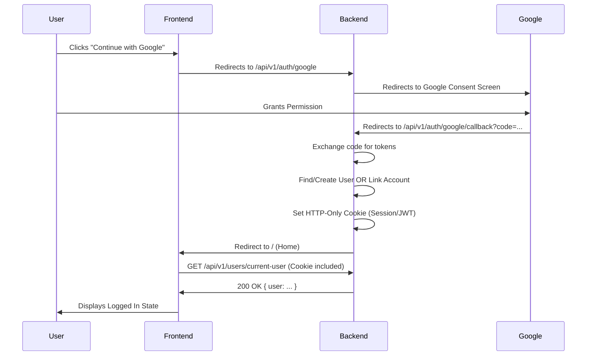

# Google OAuth Implementation Logic

This document outlines the current frontend implementation of Google OAuth in the Vixora application and provides the necessary requirements for the backend integration.

## Overview

The application uses a **Server-Side Authorization Code Flow** initiated by the frontend. The frontend does **not** handle Google tokens (Access Token / ID Token) directly. Instead, it relies on the backend to handle the OAuth handshake, create a session, and set an HTTP-Only cookie.

## Frontend Implementation Details

### 1. Initiation

The Google login process is triggered in `src/pages/auth/LoginPage.jsx`.

- **Action:** When the user clicks "Continue with Google", the frontend performs a full page redirect to the backend's Google Auth endpoint.
- **Code:**
  ```javascript
  // src/pages/auth/LoginPage.jsx
  const handleGoogleLogin = () => {
    window.location.href = getGoogleAuthUrl();
  };
  ```

### 2. API Configuration

The URL for the backend endpoint is defined in `src/services/api.js`.

- **Endpoint:** `${api.defaults.baseURL}/auth/google` (typically `/api/v1/auth/google`).
- **Axios Config:** The axios instance in `src/services/axios.js` is configured with `withCredentials: true`. This is **critical** as it allows the browser to send and receive cookies from the backend.

### 3. Session Validation (The "Callback" Mechanism)

There is **no specific frontend route** (like `/auth/callback`) to handle the token exchange. The frontend expects the backend to:

1.  Complete the OAuth flow.
2.  Set a session cookie.
3.  Redirect the browser back to the frontend application (e.g., to the dashboard or home page).

Upon loading the application, `src/context/AuthContext.jsx` automatically checks if a user is authenticated.

- **Effect:**
  ```javascript
  // src/context/AuthContext.jsx
  useEffect(() => {
    checkAuth();
  }, []);
  ```
- **Method:** `checkAuth` calls `authService.getCurrentUser()`.
- **Success:** If the backend returns a 200 OK with user data (based on the session cookie), the user is logged in.

## Backend Requirements

To make this flow work, the backend must implement the following:

### 1. Routes

- **GET /api/v1/auth/google**:
  - Should redirect the user to Google's OAuth 2.0 consent screen.
  - Include `response_type=code`, `client_id`, `redirect_uri` (backend callback), and `scope` (profile, email).

- **GET /api/v1/auth/google/callback**:
  - This is where Google redirects the user after consent.
  - **Logic:**
    1.  Exchange the `code` for an `access_token` and `id_token`.
    2.  Verify the `id_token` and extract user info (email, name, avatar).
    3.  Find or Create the user in the database.
        - _Tip:_ If creating a new user, populate their `avatar` and `fullName` from the Google profile.
    4.  **IMPORTANT:** Generate a JWT (Access Token & Refresh Token).
    5.  **IMPORTANT:** Set the Refresh Token (and optionally Access Token) as an **HTTP-Only Cookie**.
    6.  Redirect (302) the user back to the Frontend URL (e.g., `http://localhost:5173` or production URL).

- **GET /api/v1/users/current-user**:
  - Must validate the session/token cookie.
  - Return the current user's details if valid.

### 2. CORS Configuration

Since the frontend and backend likely run on different ports/domains, user credentials (cookies) must be allowed.

- `origin`: Must match the frontend origin exactly (e.g., `http://localhost:5173`). Do not use `*`.
- `credentials`: Must be set to `true`.

### 3. Error Handling

If user creation or login fails during the callback:

- Redirect to the frontend's login page with an error query parameter.
  - Example: `http://localhost:5173/login?error=auth_failed`
- The frontend can then parse this parameter and display a toast message (logic for this may need to be added to `LoginPage.jsx` if not already present).

### 4. Account Linking (Optional but Recommended)

If a user is **already logged in** (valid session cookie exists) when they initiate the OAuth flow:

- **Goal:** Link the Google account to the existing user profile.
- **Logic in Callback:**
  1.  Check for existing session/user.
  2.  If user exists, update their `authProvider` or `linkedAccounts` to include Google.
  3.  Redirect to `/settings` or the page they started from (could pass a `next` param in the initial state).

## Flow Diagram



## Summary Checklist for Backend Engineer

- [ ] Implement `GET /auth/google` redirect.
- [ ] Implement `GET /auth/google/callback` to handle code exchange.
- [ ] **Logic:**
  - If Session exists: Link Google ID to current user.
  - If No Session: Check if email exists -> Log in.
  - If Email not found -> Register new user.
- [ ] Set JWT as `httpOnly` cookie on successful callback.
- [ ] Redirect user to client origin after cookie is set.
- [ ] Ensure `GET /users/current-user` works with the cookie.
- [ ] Configure CORS with `credentials: true` and specific origin.
